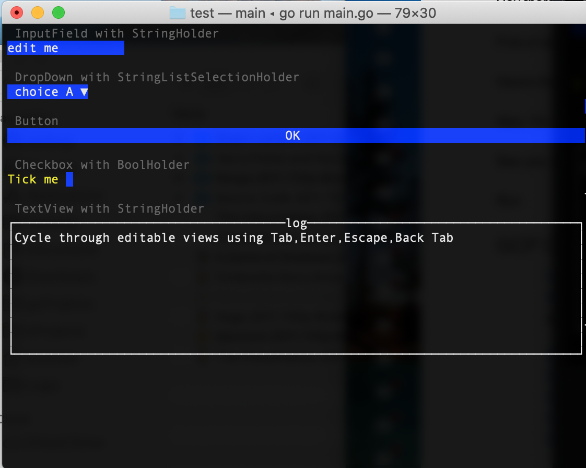

# tviewplus

This package extends the Terminal application framework https://github.com/rivo/tview.

See test folder for a screenshot and sample program using all extensions.

## extensions

- FocusGroup
- StringHolder
- StringListSelectionHolder
- BoolHolder

## test screenshot

&copy; 2020 <a href="http://ernestmicklei.com">ernestmicklei.com</a>